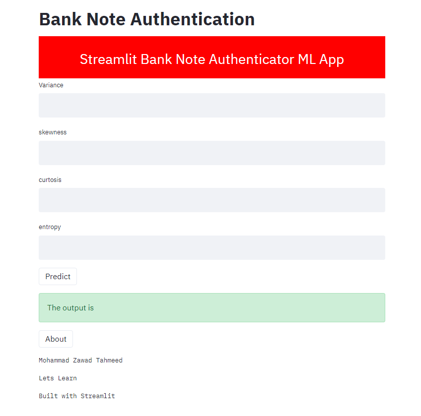

# Bank Note Authentication with Docker(Overview)

## Website UI

* Created a tool using Random Forest that recognize bank notes from a kaggle dataset with 99% accuracy.

* Optimized Random Forest to build the best model.

* Built a client facing UI using Streamlit.

* Built a client facing API using flask.

* Uploaded this project on Cloud using Heroku.

**Requirments:**

1) Python

2) Flask

3) Numpy

4) Scikit-learn

5) Matplotlib

6) Pandas

7) Flasgger

8) Streamlit

Also to run this system dowload all on the **requirements.txt**
Wuth r-install requirements.txt command

## Sources

**Dataset Link:** https://www.kaggle.com/ritesaluja/bank-note-authentication-uci-data

**Project Overview:** https://www.youtube.com/user/krishnaik06
